# Zabbix Infrastructure Monitoring Lab

## Overview

This project documents a Zabbix infrastructure monitoring lab built on Proxmox VE.

The goal of this lab was to deploy a central monitoring server and supervise multiple parts of a segmented homelab infrastructure, including Linux servers, Windows servers, Veeam Backup & Replication, DNS services, HTTP checks and an OPNsense firewall through SNMP.

## Lab Objectives

The main objectives were to:

- Install and configure Zabbix Server.
- Monitor a Linux web server using Zabbix Agent 2.
- Monitor a Windows Server domain controller using Zabbix Agent.
- Monitor HTTP availability for an Nginx web server.
- Monitor DNS availability on the domain controller.
- Create and test Zabbix triggers.
- Monitor a Veeam Backup & Replication server.
- Monitor the Veeam backup repository disk usage.
- Monitor critical Veeam services.
- Monitor OPNsense using SNMP.
- Document the architecture, configuration and validation steps.

## Lab Environment

| Component | Role |
|---|---|
| Proxmox VE | Virtualization platform |
| OPNsense | Firewall and network segmentation |
| Zabbix Server 7.4 | Central monitoring platform |
| Debian 13 | Zabbix server operating system |
| PostgreSQL | Zabbix database |
| Apache / PHP | Zabbix web frontend |
| Debian / Nginx | Linux web server monitored by Zabbix |
| Windows Server AD | Domain controller and DNS server |
| Veeam Backup Server | Backup infrastructure server |
| SNMP | Firewall monitoring protocol |

## Network Layout

| System | IP Address | Network |
|---|---:|---|
| Zabbix Server | 10.10.20.80 | SERVERS |
| SRV-AD01 | 10.10.20.10 | SERVERS |
| Veeam Backup Server | 10.10.20.70 | SERVERS |
| Debian DMZ Web Server | 10.10.30.10 | DMZ |
| OPNsense Firewall | 10.10.20.1 | SERVERS gateway |

## Monitored Hosts

| Host | Monitoring Method | Purpose |
|---|---|---|
| zabbix-monitor01 | Local Zabbix Agent 2 | Monitor the Zabbix server itself |
| debian-dmz-web01 | Zabbix Agent 2 | Linux metrics and Nginx server |
| SRV-AD01 | Zabbix Agent for Windows | Windows Server and DNS monitoring |
| veeam-backup01 | Zabbix Agent for Windows | Backup server and repository monitoring |
| opnsense-lab | SNMP | Firewall and network interface monitoring |

## Monitoring Scope

This lab validates several monitoring scenarios:

- Linux host monitoring
- Windows Server monitoring
- HTTP service monitoring
- DNS service monitoring
- Veeam repository monitoring
- Critical Windows service monitoring
- OPNsense firewall monitoring through SNMP
- Trigger creation and alert validation

## Final Result

This lab validates a complete infrastructure monitoring setup using Zabbix.

The monitoring covers Linux, Windows Server, DNS, HTTP, Veeam Backup & Replication and OPNsense firewall metrics.

The project demonstrates how a system and network administrator can use Zabbix to monitor infrastructure health, detect service outages and validate alerting workflows.

## Screenshots

### Linux host metrics from debian-dmz-web01

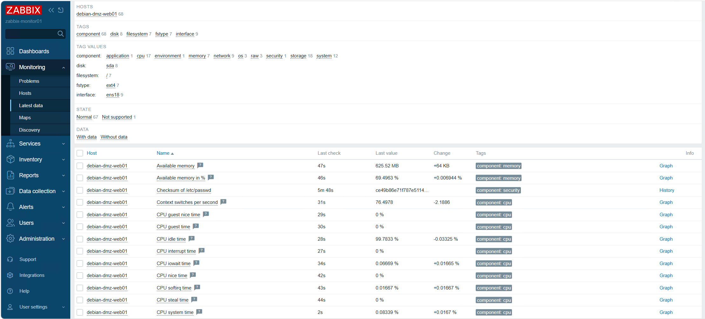

### Nginx HTTP check with response code 200

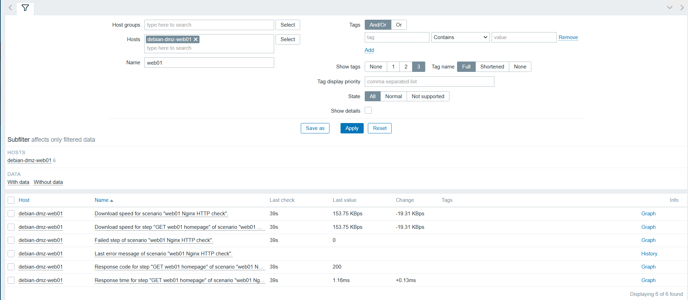

### SRV-AD01 Windows agent availability

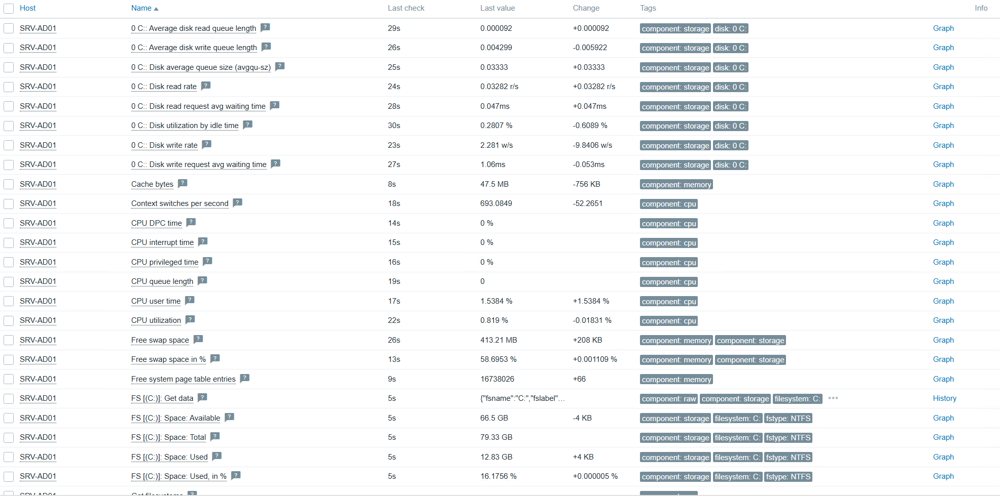

### SRV-AD01 DNS TCP 53 check

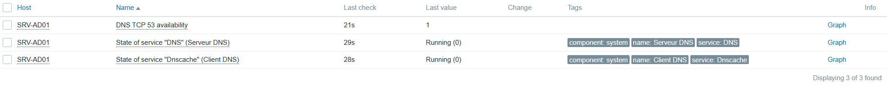

### DNS trigger configured

### DNS alert in PROBLEM state

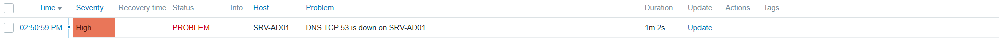

### DNS alert resolved

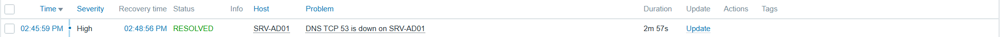

### Veeam repository disk monitoring

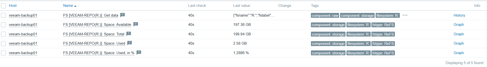

### Veeam repository usage trigger

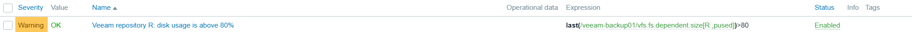

### Veeam services monitoring

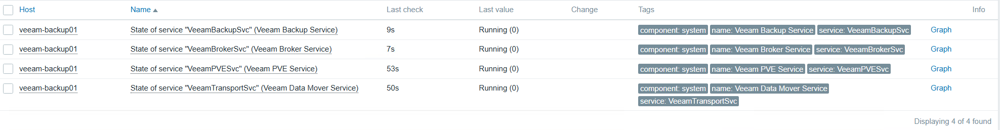

### Veeam services triggers

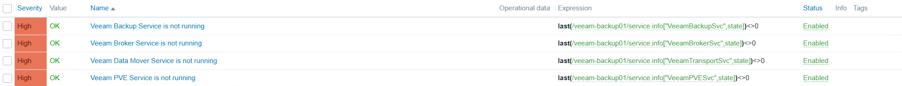

### OPNsense SNMP monitoring

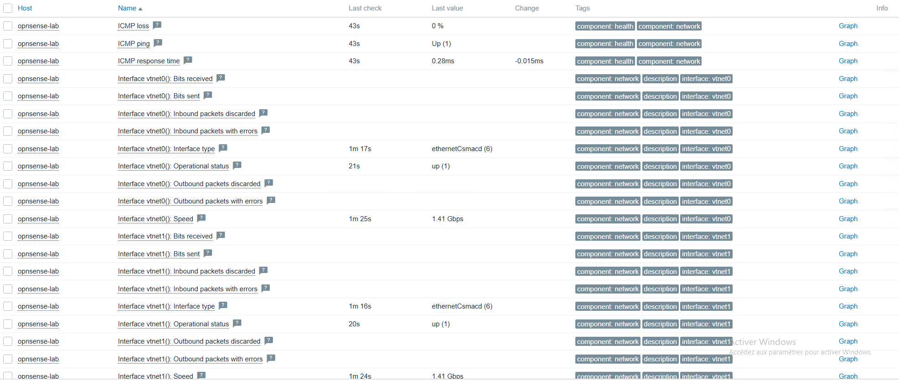

